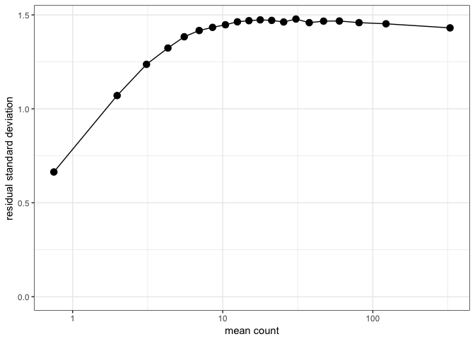
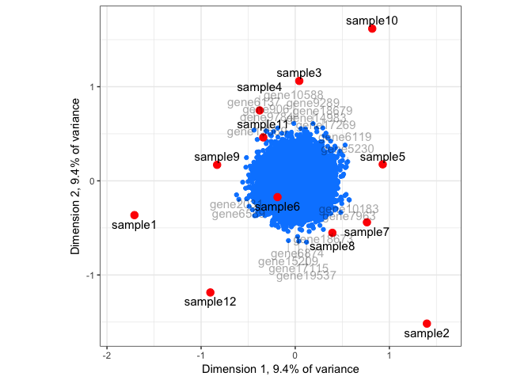
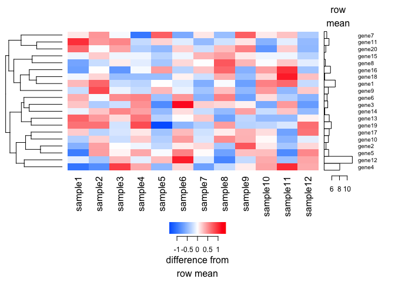

varistran review
================
2017-07-27

Installation works great
========================

``` r
install.packages("devtools")
```

    ## 
    ## The downloaded binary packages are in
    ##  /var/folders/z6/vlq46wcn68d_knbqlyzd__w40000gn/T//RtmpCLKAQT/downloaded_packages

``` r
devtools::install_github("MonashBioinformaticsPlatform/varistran")
```

    ## Skipping install of 'varistran' from a github remote, the SHA1 (739c668e) has not changed since last install.
    ##   Use `force = TRUE` to force installation

Testing
=======

Would be nice if in main description on the github page, the bottomly dataset or one of the other test datasets was shown as setup as a test set. I only discovered some test datasets by looking at the tests.

NBPSeq isn't mentioned as a dependency anywhere, but is required to run the *vst\_stability\_plots.R* test.

Testing of the bottomly dataset in *vst\_stability\_plots.R* fails:

    Bottomly

    Error in validObject(.Object) :
      invalid class “DESeqDataSet” object: levels of factors in the design contain characters other than letters, numbers, '_' and '.'

I fixed this in a pull request and it seems to work fine. The rest of the tests passed fine.

Test on non-included dataset
============================

Here we test on a dataset that wasn't included in the tests by generating a fake example dataset and running it through.

``` r
library(DESeq2)
```

    ## Loading required package: S4Vectors

    ## Loading required package: stats4

    ## Loading required package: BiocGenerics

    ## Loading required package: parallel

    ## 
    ## Attaching package: 'BiocGenerics'

    ## The following objects are masked from 'package:parallel':
    ## 
    ##     clusterApply, clusterApplyLB, clusterCall, clusterEvalQ,
    ##     clusterExport, clusterMap, parApply, parCapply, parLapply,
    ##     parLapplyLB, parRapply, parSapply, parSapplyLB

    ## The following objects are masked from 'package:stats':
    ## 
    ##     IQR, mad, sd, var, xtabs

    ## The following objects are masked from 'package:base':
    ## 
    ##     anyDuplicated, append, as.data.frame, cbind, colMeans,
    ##     colnames, colSums, do.call, duplicated, eval, evalq, Filter,
    ##     Find, get, grep, grepl, intersect, is.unsorted, lapply,
    ##     lengths, Map, mapply, match, mget, order, paste, pmax,
    ##     pmax.int, pmin, pmin.int, Position, rank, rbind, Reduce,
    ##     rowMeans, rownames, rowSums, sapply, setdiff, sort, table,
    ##     tapply, union, unique, unsplit, which, which.max, which.min

    ## 
    ## Attaching package: 'S4Vectors'

    ## The following object is masked from 'package:base':
    ## 
    ##     expand.grid

    ## Loading required package: IRanges

    ## Loading required package: GenomicRanges

    ## Loading required package: GenomeInfoDb

    ## Loading required package: SummarizedExperiment

    ## Loading required package: Biobase

    ## Welcome to Bioconductor
    ## 
    ##     Vignettes contain introductory material; view with
    ##     'browseVignettes()'. To cite Bioconductor, see
    ##     'citation("Biobase")', and for packages 'citation("pkgname")'.

    ## Loading required package: DelayedArray

    ## Loading required package: matrixStats

    ## 
    ## Attaching package: 'matrixStats'

    ## The following objects are masked from 'package:Biobase':
    ## 
    ##     anyMissing, rowMedians

    ## 
    ## Attaching package: 'DelayedArray'

    ## The following objects are masked from 'package:matrixStats':
    ## 
    ##     colMaxs, colMins, colRanges, rowMaxs, rowMins, rowRanges

    ## The following object is masked from 'package:base':
    ## 
    ##     apply

``` r
dds = makeExampleDESeqDataSet(n = 20000, m = 12, betaSD = 0, interceptMean = 4,
                              interceptSD = 2, dispMeanRel = function(x) 4/x + 0.1)
counts = counts(dds, normalized=FALSE)
condition = c(rep("A", 6), rep("B", 6))
design = model.matrix(~condition)
```

``` r
y <- varistran::vst(counts, design=design)
```

    ## Dispersion estimated as 0.02296855

``` r
print(varistran::vst_advice(y))
```

    ##    count transformed_count twofold_step
    ## 1      0          3.688856           NA
    ## 2      1          3.933641           NA
    ## 3      2          4.092783    0.1591422
    ## 4      4          4.326729    0.2339461
    ## 5      8          4.657321    0.3305923
    ## 6     16          5.106313    0.4489912
    ## 7     32          5.687877    0.5815648
    ## 8     64          6.399400    0.7115221
    ## 9    128          7.219178    0.8197782
    ## 10   256          8.115597    0.8964192
    ## 11   512          9.059492    0.9438948
    ## 12  1024         10.030197    0.9707057
    ## 13  2048         11.015215    0.9850181
    ## 14  4096         12.007637    0.9924220

``` r
varistran::plot_stability(y, counts, design=design)
```



``` r
varistran::plot_biplot(y)
```



Would be nice if the plot\_heatmap function subset the variable genes so it did not plot the whole thing by default.

``` r
varistran::plot_heatmap(y[1:20,])
```



Further testing
===============

    R CMD check fails:

    * using session charset: UTF-8
    * checking for file ‘./DESCRIPTION’ ... ERROR
    Required field missing or empty:
      ‘Author’
    * DONE
